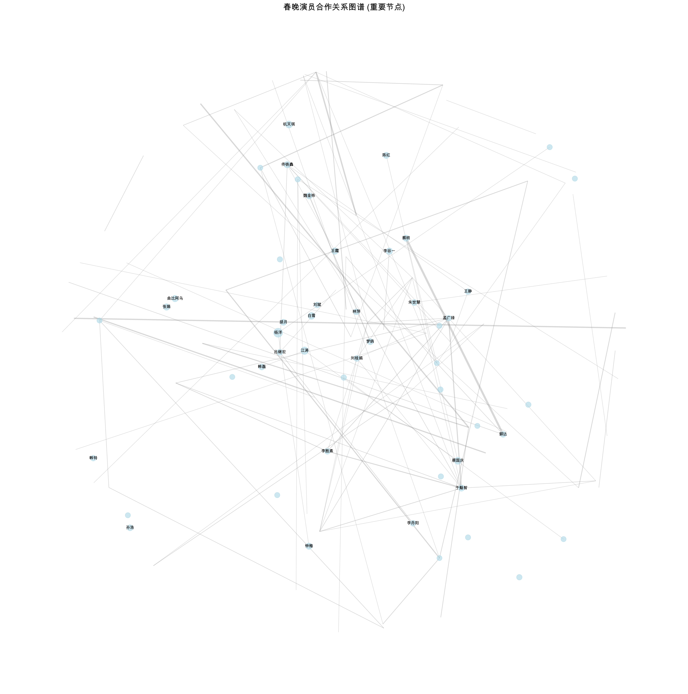

# Chunwan Database & Analysis

## Introduction

This is a simple analysis, with data of the Chinese New Year Gala (Chunwan) database. 

The database contains information about programs, actors and actresses who have participated in the Chunwan from 1983 to 2015. 

The data was collected from:
- CCTV Official Website (cctv.com)
- Historical Weibo Program Lists
- Spring Festival Gala Archives
- Media Reports and News Articles

Data collection for 2016-2025 is ongoing through:
- Annual CCTV Spring Festival Gala broadcasts
- Official CCTV social media accounts
- Press releases and media coverage
- Program lists from CCTV websites

## 介绍

这是一个关于春晚节目单的数据库以及简单分析。

数据库包含了从1983年到2015年参加春晚的演员和节目的信息。

数据来自：
- cctv.cn
- 历年春晚微博节目单
- http://webftp.bbs.hnol.net/dysr/201301/CW30Y_cctv/CW30Y_cctv_JMD_20130308.htm (Special Thanks)
- 央视网春晚官方资料
- 各大媒体报道整理

2016-2025年的数据正在通过以下渠道收集整理中：
- 央视春晚直播节目
- CCTV官方社交媒体账号
- 新闻发布会及媒体报道
- 央视网站节目单

## 发现

### 1. 最常合作的演员对

郭达-蔡明: 16次合作, 年份:[1993, 1994, 1995, 1996, 1997, 1998, 1999, 2001, 2002, 2003, 2005, 2006, 2007, 2008, 2009, 2010]
冯巩-牛群: 11次合作, 年份:[1989, 1990, 1991, 1992, 1993, 1994, 1995, 1996, 1997, 1998, 1999]
姜昆-唐杰忠: 10次合作, 年份:[1986, 1987, 1988, 1989, 1990, 1991, 1992, 1993]
陈佩斯-朱时茂: 10次合作, 年份:[1984, 1985, 1986, 1989, 1990, 1991, 1992, 1997, 1998]
侯耀文-石富宽: 9次合作, 年份:[1983, 1986, 1987, 1992, 1993, 1997, 2002, 2004, 2005]
姜昆-戴志诚: 8次合作, 年份:[1996, 1997, 2000, 2001, 2002, 2009, 2010, 2011]
赵本山-范伟: 8次合作, 年份:[1995, 1996, 1998, 2001, 2002, 2003, 2004, 2005]
孟广禄-于魁智: 8次合作, 年份:[1997, 1998, 2000, 2002, 2003, 2007, 2010, 2011]
黄宏-巩汉林: 7次合作, 年份:[1997, 2002, 2005, 2006, 2008, 2009, 2010]
魏金栋-梦鸽: 7次合作, 年份:[1991, 1992, 1993, 1994, 1998, 2005, 2007]

### 2. 参与最多的演员

杨洋: 中心度 0.060
江涛: 中心度 0.042
蔡国庆: 中心度 0.038
杭天琪: 中心度 0.037
白雪: 中心度 0.035
李谷一: 中心度 0.032
王霞: 中心度 0.032
张娟: 中心度 0.032
曲比阿乌: 中心度 0.031
佟铁鑫: 中心度 0.030

### 3. 最有'人缘'的演员(度中心度):

杨洋: 度中心度 0.060 (直接合作过 101 位演员)
江涛: 度中心度 0.042 (直接合作过 71 位演员)
蔡国庆: 度中心度 0.038 (直接合作过 63 位演员)
杭天琪: 度中心度 0.037 (直接合作过 62 位演员)
白雪: 度中心度 0.035 (直接合作过 59 位演员)
李谷一: 度中心度 0.032 (直接合作过 54 位演员)
王霞: 度中心度 0.032 (直接合作过 54 位演员)
张娟: 度中心度 0.032 (直接合作过 53 位演员)
曲比阿乌: 度中心度 0.031 (直接合作过 52 位演员)
佟铁鑫: 度中心度 0.030 (直接合作过 51 位演员)

### 4. 最善于'牵线搭桥'的演员(中介中心度)

杨洋: 中介中心度 0.058
刘桂娟: 中介中心度 0.040
黄宏: 中介中心度 0.040
李谷一: 中介中心度 0.034
江涛: 中介中心度 0.030
刘斌: 中介中心度 0.028
蔡明: 中介中心度 0.027
王霞: 中介中心度 0.027
曲比阿乌: 中介中心度 0.027
严顺开: 中介中心度 0.024

### 5. 重要演员的合作统计

杨洋:
- 合作过的演员数: 101
- 总合作次数: 114
- 活跃年份: [1996, 1997, 1998, 2000, 2001, 2003]
- 跨越年份: 7年

江涛:
- 合作过的演员数: 71
- 总合作次数: 81
- 活跃年份: [1993, 1995, 1996, 1997, 1998, 1999, 2000, 2001, 2003, 2008, 2011]
- 跨越年份: 18年

蔡国庆:
- 合作过的演员数: 63
- 总合作次数: 72
- 活跃年份: [1994, 1996, 1998, 1999, 2000, 2001, 2003, 2005, 2006, 2007, 2008, 2009, 2010, 2011, 2012, 2014]
- 跨越年份: 20年

杭天琪:
- 合作过的演员数: 62
- 总合作次数: 66
- 活跃年份: [1990, 1991, 1992, 1993, 1994, 1996, 1998, 2001]
- 跨越年份: 11年

白雪:
- 合作过的演员数: 59
- 总合作次数: 65
- 活跃年份: [1996, 1998, 2000, 2003, 2005, 2008]
- 跨越年份: 12年

总演员数: 1677
总合作关系数: 6657
平均合作次数: 1.09

### 6. 重要演员的合作网络

# License
MIT
CC 4.0 BY-NC-SA